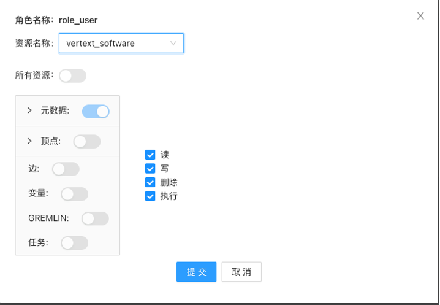

# 6. Hugegraph-Hubble 使用说明
## 6.1 概述
Hugegraph-hubble 是 Hugegragh 的可视化应用管理工具。该应用主要包括三个组件：数据管理、运维管理、系统管理。Hubble的用户权限等级分为普通用户、图空间管理员、超级管理员三个级别。不同等级的用户可使用的功能组件不同。
 - 数据管理组件主要提供管理管理图数据等，包括图以及元数据管理、数据查询、权限管理等与数据相关的管理操作。普通用户权限即可使用。

 - 运维管理组件对外提供服务管理、日志查看等功能。该功能需要图空间管理员权限才可使用。

 - 系统管理组件主要包括图空间管理和用户管理。需要超级管理员权限。

## 6.2 数据管理-数据分析

下边通过创建一个图来说明Hubble中数据管理模块中数据分析的使用。过程中包含创建schema、创建或更新数据（顶点、边）以及图形化展示
### 6.2.1 创建Schema
此例中涉及的Schema有三类，分别是：属性（PropertyKey），顶点类型（VertexLabel）和边类型（EdgeLabel）。下面依次创建这些Schema。

#### 6.2.1.1 创建属性
将下面的语句输入到 Hubble 的输入框中:
   ```
   graph.schema().propertyKey("name").asText().ifNotExist().create()
   graph.schema().propertyKey("age").asInt().ifNotExist().create()
   graph.schema().propertyKey("city").asText().ifNotExist().create()
   graph.schema().propertyKey("lang").asText().ifNotExist().create()
   graph.schema().propertyKey("date").asText().ifNotExist().create()
   graph.schema().propertyKey("price").asInt().ifNotExist().create()
   ```
关于上述语句的几点说明如下：
 1. 上述语句是groovy语言形式（类似但不是java）的gremlin语句，这些gremlin语句会被发送到HugeGraphServer上执行。关于gremlin本身可以参考附录中《Gremlin语法使用手册》
 2. 上述语句是通过graph.schema()获取到SchemaManager对象后操作元数据，通过gremlin语句操作Schema。
 3. 在HugeGraph-Hubble的输入框中，用户可以直接使用两个变量graph和g，其中graph就是当前连接的图对象，可使用该对象对图做各种增删改查操作; g是用于遍历图的一个对象，其本质就是graph.traversal()，用户可以使用该对象做各种遍历操作；
 4. HugeGraph-Hubble作为一个展示图的工具，主要用于做查询或遍历，不宜做太多增删改的操作。

#### 6.2.1.2 创建顶点类型（VertexLabel）
将下面的语句输入到 Hubble 的输入框中：
```
person = graph.schema().vertexLabel("person") .properties("name", "age", "city") .primaryKeys("name").ifNotExist().create()

software = graph.schema().vertexLabel("software").properties("name", "lang", "price").primaryKeys("name").ifNotExist().create()
```

#### 6.2.1.3 创建边类型（EdgeLabel）
将下面的语句输入到 Hubble 的输入框中：
```
knows = graph.schema().edgeLabel("knows").sourceLabel("person").targetLabel("person").properties("date").ifNotExist().create()

created = graph.schema().edgeLabel("created").sourceLabel("person").targetLabel("software").properties("date", "city").ifNotExist().create()

```
### 6.2.2 创建顶点和边
创建了Schema后，就可以根据Schema创建特定的顶点和边了，这里我们定义两个person类型的顶点实例：marko 和 vadas，再定义两者之间的关系knows：

```
marko = graph.addVertex(T.label, "person", "name", "marko", "age", 29, "city", "Beijing")

vadas = graph.addVertex(T.label, "person", "name", "vadas", "age", 27, "city", "Hongkong")

marko.addEdge("knows", vadas, "date", "20160110")
```
在页面中输入语句，这样我们就创建了两个顶点一条边

### 6.2.3 新增/更新数据
通过以下方法可以新增/更新数据：
```
marko = graph.addVertex(T.label, "person", "name", "marko", "age", 29, "city", "Beijing")
vadas = graph.addVertex(T.label, "person", "name", "vadas", "age", 27, "city", "Hongkong")
lop = graph.addVertex(T.label, "software", "name", "lop", "lang", "java", "price", 328)
josh = graph.addVertex(T.label, "person", "name", "josh", "age", 32, "city", "Beijing")
ripple = graph.addVertex(T.label, "software", "name", "ripple", "lang", "java", "price", 199)
peter = graph.addVertex(T.label, "person","name", "peter", "age", 29, "city", "Shanghai")

marko.addEdge("knows", vadas, "date", "20160110")
marko.addEdge("knows", josh, "date", "20130220")
marko.addEdge("created", lop, "date", "20171210", "city", "Shanghai")
josh.addEdge("created", ripple, "date", "20151010", "city", "Beijing")
josh.addEdge("created", lop, "date", "20171210", "city", "Beijing")
peter.addEdge("created", lop, "date", "20171210", "city", "Beijing")
```

### 6.2.4 展示图
HugeGraph-Hubble支持三种方式展示图，分别为：图模式、表格模式、Json模式。例如g.E()的展示如下图所示。

图模式：


表格模式：


Json模式：


## 6.3 数据管理-权限管理

权限管理仅对开启鉴权的图空间有效。开启鉴权的图空间下会默认生成id为“DEFAULT_SPACE_TARGET”的资源和id为“DEFAULT_SPACE_ADMIN”的角色，并关联到当前图空间的管理员。

Hubble支持多用户认证、以及细粒度的权限访问控制，采用基于“用户-用户组-操作-资源”的4层设计，灵活控制用户角色与权限。 资源用于描述图数据库中的数据，用户可以属于一个或多个用户组， 每个用户组可以拥有对任意个资源的操作权限，操作类型包括：读、写、删除、执行等种类。

授权流程包括如下步骤：资源创建 --> 角色创建 --> 关联资源 --> 关联用户。

### 6.3.1 创建资源
如下图所示，创建了一个名为vertext_software的资源，描述可以访问图hugegraph下的类型为sotfware的顶点。注：授权顶点等资源时，必须授权元数据信息才可访问。


### 6.3.2 创建角色
如下图所示，创建角色名为role_user的角色。


### 6.3.3 关联资源
如下图所示，为角色role_user关联资源，并给予读写删除执行权限。当选择资源名，会加载资源相关的信息到当前页面。



### 6.3.4 关联用户
为角色role_user关联用户，也可同时选择多个用户进行编辑操作。


## 6.4 运维管理-服务
服务内容包括四个模块：
 - 图服务：管理图服务的创建、删除等。
 - 存储服务：查看当前存储服务的节点信息等，并可执行节点的上线、下线操作。
 - 计算任务：查看指定图上的计算任务信息。
 - PD状态：查看PD集群各节点的状态。

服务的管理等操作需要图空间管理员或超级管理员权限。

除图服务外，其他模块以查询展示为主，不做太多描述。

### 6.4.1 创建图服务
一个图服务对应一套Hugegraph-Server，对外提供图管理、查询等功能的服务，hubble提供的所有功能都是通过图服务接口实现的。

在集群安装初始化时，会默认生成DEFAULT图空间，并在DEFAULT图空间下生成一个名为DEFAULT的图服务。

除此之外，用户可在不同的图空间下通过点击右侧创建服务按钮创建新的图服务，达到不同图空间下的资源隔离的目的

图服务的创建分为手动和容器两种模式。

#### 6.4.1.1 创建图服务-手动模式
 - 参考"使用手动部署HugeGraph-Server"中的内容，启动一个HugeGraph-Server。
 - 在hubble中创建运行模式为“手动”的图服务，并填写新创建的HugeGraph-server的地址。如图所示：


#### 6.4.1.2 创建图服务-容器模式
容器模式下创建的图服务是运行在k8s环境中的，其运行在当前图空间中指定的k8s namespace下。如图所示：


 - 实例Max：表示k8s中，要启动的pods数量
 - CPU最大值/内存最大值：设置启动的pod的cpu/内存最大值

### 6.4.2 查看、管理图服务
点击左侧导航栏中运维管理下的服务，默认显示当前租户空间下所有的图服务列表信息。 如图所示：


手动启动的图服务不提供停止和启动功能，如需删除，需要先手动停止Hugegraph-Server。再在当前列表中删除实例。

## 6.5 系统管理-图空间管理

图空间是进行资源隔离的基本单元，可以在创建图空间时，指定各模块可使用的最大资源数。一个图空间下，可以创建多个查询服务，也可以创建多个计算任务。

另，图空间的管理需要超级管理员权限，系统默认提供名为admin的超级管理员账号。

### 6.5.1 创建图空间
选择左侧导航栏中的系统管理下的图空间管理，并点击右上角的创建图空间按钮，即可开启创建图空间流程。如下图所示（星号标记的部分为必填）：


图空间配置选项中，大致分为四种类型：
 - 图空间基本属性：
    - 图空间名称、最大图数、最大角色、描述
    - 图空间管理员：多选
    - 是否开启鉴权：默认关闭；当开启鉴权，普通用户需要授权之后才可访问；图空间创建之后，不允许编辑。
 - 图服务相关：
    - CPU/内存资源：当前图空间下所有查询服务的资源使用上线；
    - k8s命名空间：表示通过容器方式启动的查询服务所使用的k8s namepsace，要符合k8s的命名规范。
 - 计算任务相关：
    - CPU/内存资源：所有正在运行的计算任务的资源使用上限；
    - k8s namespace：计算任务启动时所使用的k8s namespace，要符合k8s的命名规范。
    - Operator镜像地址：填写Operator的镜像地址。
    - 算法镜像地址：填写算法的镜像地址。
 - 存储服务：
    - 设置硬盘资源：当前图空间下所有图的存储资源使用上限。

### 6.5.2 编辑、删除图空间

选择左侧导航栏中的系统管理下的图空间管理，可以查看所有的图空间列表。通过列表中的右侧按钮，可以编辑、删除图空间。如下图所示


## 6.6 系统管理-用户管理
### 6.6.1 创建用户
选择左侧导航栏中的系统管理下的用户管理，并点击右上角的创建用户按钮，即可开启创建流程。创建用户时，可指定当前创建的用户是否为超级管理员。

如下图所示（星号标记的部分为必填）：


### 6.6.2 编辑、删除用户
选择左侧导航栏中的系统管理下的用户管理，可以查看所有的用户列表。通过列表中的右侧按钮，可以编辑、删除用户。

如下图所示：


